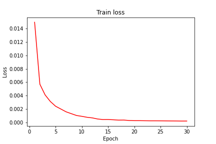

  

# Perceiver-image-classification
Training and testing deep-mind's perceiverIO model for image classification task.

PerceiverIO Paper, found at https://arxiv.org/abs/2107.14795

## PerceiverIO
The PerceiverIO used in this model is lucidrains's implemenation, found at https://github.com/lucidrains/perceiver-pytorch.

Accuracy, and test/train loss plots:

